# BÁO CÁO THỰC TẬP: XÂY DỰNG VÀ ĐÁNH GIÁ THƯ VIỆN LIÊN KẾT TĨNH VÀ LIÊN KẾT ĐỘNG TRONG NGÔN NGỮ C

- **Người thực hiện:** Sơn Vũ
- **Mục tiêu:** Xây dựng thư viện xử lý chuỗi `strutils`; đóng gói thư viện dưới hai dạng thư viện tĩnh (static library, `.a`) và thư viện động (shared library, `.so`); kiểm thử các hàm với đầu vào thông thường, giá trị biên và đầu vào lỗi; tự động hoá quá trình biên dịch bằng Makefile; đối chiếu đặc điểm của hai hình thức liên kết. Bài tập bổ sung khảo sát cách bố trí bộ nhớ (memory layout) của một chương trình C.

---

## TÓM TẮT

Báo cáo trình bày quá trình thiết kế thư viện `strutils` gồm ba hàm `str_reverse`, `str_trim` và `str_to_int`, sau đó đóng gói thư viện thành `libstrutils.a` và `libstrutils.so`. Hai tệp hoạt động `main_static` và `main_shared` được tạo từ cùng một mã nguồn kiểm thử nhưng khác nhau về hình thức liên kết, và sự khác biệt được chứng minh bằng các công cụ `ldd`, `nm` và `size`. Các thí nghiệm bổ sung cho thấy: 
    (i) tệp hoạt động liên kết tĩnh không phụ thuộc vào thư viện ngoài của `strutils` khi chạy nhưng phải được liên kết lại sau khi mã thư viện thay đổi; 
    (ii) tệp hoạt động liên kết động phụ thuộc vào việc bộ nạp động xác định được vị trí của thư viện tại thời điểm hoạt động. Phần bài tập bổ sung phân tích địa chỉ của các loại biến trong chương trình C nhằm xác định vùng nhớ tương ứng của từng loại.


## 1. CẤU TRÚC THƯ MỤC DỰ ÁN

```
embedded_linux_lab/
├── README.md               # Báo cáo kỹ thuật
├── pics/
├── strutils_lab/
│   ├── strutils.h          # Tệp tiêu đề: khai báo giao diện của thư viện
│   ├── strutils.c          # Cài đặt các hàm của thư viện
│   ├── main.c              # Chương trình kiểm thử
│   ├── Makefile            # Tự động hoá quá trình xây dựng
└── memory_layout_lab/
    ├── main.c              # Chương trình khảo sát địa chỉ các vùng nhớ

```

Các tệp sinh ra trong quá trình xây dựng (`.o`, `.a`, `.so` và tệp hoạt động) không được đưa vào kho mã nguồn.

## 2. BÀI 1: THIẾT KẾ VÀ CÀI ĐẶT THƯ VIỆN STRUTILS

### 2.1. Yêu cầu thiết kế

Thư viện cần cung cấp tối thiểu ba hàm xử lý chuỗi:

1. `str_reverse`: đảo ngược chuỗi tại chỗ (in-place).
2. `str_trim`: loại bỏ khoảng trắng ở đầu và cuối chuỗi, thực hiện tại chỗ.
3. `str_to_int`: chuyển chuỗi ký tự sang số nguyên một cách an toàn, có khả năng phát hiện đầu vào không hợp lệ và tràn số.

### 2.2. Thiết kế và giải thích thuật toán

#### Hàm 1: `void str_reverse(char *s)`

- **Mục đích:** Đảo ngược thứ tự ký tự của chuỗi ngay trên mảng được truyền vào, không cấp phát thêm bộ nhớ.
- **Thuật toán:**
  1. Nếu `s == NULL`, hàm kết thúc ngay nhằm tránh truy cập bộ nhớ không hợp lệ.
  2. Độ dài chuỗi được xác định bằng `strlen`. Nếu độ dài nhỏ hơn 2, chuỗi được giữ nguyên.
  3. Sử dụng kỹ thuật hai chỉ số: `i = 0` (đầu chuỗi) và `j = len - 1` (cuối chuỗi). Trong vòng lặp `while (i < j)`, hai ký tự `s[i]` và `s[j]` được hoán đổi, sau đó `i` tăng và `j` giảm một đơn vị.
  4. Độ phức tạp thời gian là O(n); độ phức tạp bộ nhớ phụ là O(1).
- **Lưu ý:** Đối số truyền vào phải là mảng có thể ghi (`char s[]`). Chuỗi hằng (`char *s = "abc"`) nằm ở vùng nhớ chỉ đọc nên việc ghi vào đó gây ra hành vi không xác định.

#### Hàm 2: `void str_trim(char *s)`

- **Mục đích:** Loại bỏ các ký tự khoảng trắng (theo hàm `isspace`) ở đầu và cuối chuỗi, thực hiện tại chỗ.
- **Thuật toán:**
  1. Nếu `s == NULL`, hàm kết thúc.
  2. Con trỏ `start` duyệt từ đầu chuỗi, bỏ qua các ký tự khoảng trắng.
  3. Nếu `*start == '\0'` (chuỗi rỗng hoặc chỉ chứa khoảng trắng), gán `s[0] = '\0'` và kết thúc.
  4. Con trỏ `end` duyệt ngược từ cuối chuỗi để xác định ký tự có nghĩa cuối cùng, sau đó ký tự kết thúc `'\0'` được đặt ngay sau vị trí này.
  5. Nếu đầu chuỗi có khoảng trắng (`start != s`), hàm `memmove` dịch chuyển phần nội dung hợp lệ về đầu mảng.
- **Lưu ý kỹ thuật:** Hàm `memmove` được sử dụng thay cho `memcpy` vì vùng nguồn và vùng đích chồng lấn lên nhau. Đối số của `isspace` được ép kiểu `(unsigned char)` theo yêu cầu của chuẩn C để tránh hành vi không xác định đối với các ký tự có giá trị âm.

#### Hàm 3: `int str_to_int(const char *s, int *out)`

- **Mục đích:** Chuyển chuỗi sang kiểu `int` và báo cáo lỗi một cách tường minh. Hàm trả về `0` khi thành công (kết quả được ghi vào `*out`) và `-1` khi đầu vào không hợp lệ.
- **Thuật toán:**
  1. Nếu `s == NULL` hoặc `out == NULL`, hàm trả về `-1`.
  2. Gán `errno = 0` rồi gọi `strtol(s, &endptr, 10)`.
  3. Nếu `endptr == s` (không nhận dạng được chữ số nào), hàm trả về `-1`.
  4. Các khoảng trắng ở cuối chuỗi được bỏ qua; nếu vẫn còn ký tự lạ (ví dụ `"12abc"`), hàm trả về `-1`.
  5. Nếu `errno == ERANGE` hoặc giá trị nằm ngoài đoạn `[INT_MIN, INT_MAX]`, hàm trả về `-1` do tràn số.
  6. Trong các trường hợp còn lại, hàm gán `*out = (int)v` và trả về `0`.
- **Lựa chọn thiết kế:**
  - Hàm `strtol` được ưu tiên hơn `atoi` vì `atoi` không có cơ chế báo lỗi: `atoi("abc")` và `atoi("0")` cùng trả về `0`, do đó không thể phân biệt đầu vào lỗi với giá trị hợp lệ.
  - Kết quả được trả qua con trỏ `out`, còn giá trị trả về của hàm dành riêng cho mã trạng thái, qua đó phân biệt được "số 0 hợp lệ" với "đầu vào lỗi".

### 2.3. Các trường hợp kiểm thử

| Hàm | Trường hợp thông thường | Giá trị biên | Đầu vào lỗi |
|-----|-------------------------|--------------|-------------|
| `str_reverse` | `"hello"`, `"abcd"` | `"a"`, `""` | Không áp dụng |
| `str_trim` | `"   hello world  "`, `"hello"` | `"     "`, `""` | Không áp dụng |
| `str_to_int` | `"123"`, `"-45"`, `"  7  "` | `"2147483647"` (INT_MAX), `"-2147483648"` (INT_MIN) | `"2147483648"`, `"abc"`, `"12abc"`, `""`, `NULL` |

### 2.4. Lệnh biên dịch và chạy kiểm thử

```bash
# Biên dịch chương trình kiểm thử cùng mã nguồn thư viện, bật đầy đủ cảnh báo
gcc -Wall -Wextra strutils.c main.c -o test_nhanh

# hoạt động chương trình kiểm thử
./test_nhanh
```

### 2.5. Kết quả

Quá trình biên dịch với các tuỳ chọn `-Wall -Wextra` không phát sinh cảnh báo. Các trường hợp thông thường và giá trị biên cho kết quả đúng; mọi đầu vào lỗi đều được hàm phát hiện và báo lỗi.

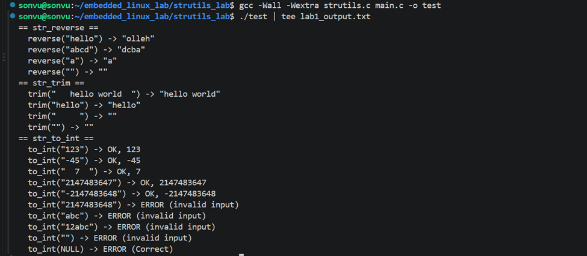

*Hình 1. Kết quả hoạt động chương trình kiểm thử Bài 1.*

## 3. BÀI 2: ĐÓNG GÓI THƯ VIỆN TĨNH VÀ THƯ VIỆN ĐỘNG

### 3.1. Thư viện tĩnh `libstrutils.a`

- **Mục đích:** Thư viện tĩnh là một tệp lưu trữ (archive) chứa các tệp đối tượng (object file). Khi liên kết, trình liên kết (linker) trích xuất mã máy cần thiết từ thư viện và sao chép vào tệp hoạt động.
- **Các lệnh thực hiện:**

```bash
# Bước 1: biên dịch strutils.c thành tệp đối tượng
gcc -Wall -Wextra -c strutils.c -o strutils.o

# Bước 2: đóng gói thành thư viện tĩnh bằng tiện ích 'ar'
ar rcs libstrutils.a strutils.o
```

- **Ý nghĩa các cờ của `ar rcs`:**
  - `r`: thêm hoặc thay thế tệp đối tượng trong kho lưu trữ.
  - `c`: tạo kho lưu trữ nếu chưa tồn tại.
  - `s`: tạo bảng chỉ mục ký hiệu để trình liên kết tra cứu hàm nhanh hơn.

### 3.2. Thư viện động `libstrutils.so`

- **Mục đích:** Thư viện động được nạp vào bộ nhớ tại thời điểm hoạt động và có thể được nhiều tiến trình dùng chung.
- **Các lệnh thực hiện:**

```bash
# Bước 1: biên dịch với cờ -fPIC
gcc -Wall -Wextra -fPIC -c strutils.c -o strutils_pic.o

# Bước 2: tạo thư viện động
gcc -shared -o libstrutils.so strutils_pic.o
```

- **Ý nghĩa các cờ:**
  - `-fPIC` (Position Independent Code): sinh mã máy sử dụng địa chỉ tương đối thay cho địa chỉ tuyệt đối, cho phép nạp thư viện vào địa chỉ bất kỳ.
  - `-shared`: chỉ thị cho gcc tạo thư viện động thay vì tệp hoạt động.

### 3.3. Kiểm tra kết quả đóng gói

```bash
ar t libstrutils.a
nm libstrutils.a
file libstrutils.so
nm -D libstrutils.so | grep str_
ls -l libstrutils.a libstrutils.so
```

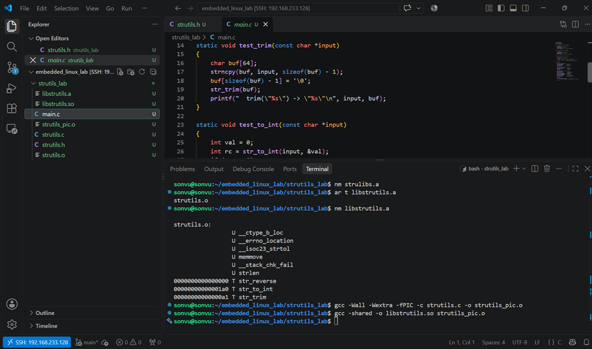

*Hình 2.1. Kết quả lệnh `nm libstrutils.a`.*

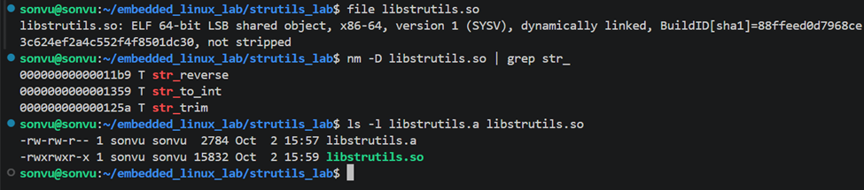

*Hình 2.2. Kết quả kiểm tra `libstrutils.so` và dung lượng của hai thư viện.*

**Nhận xét:**

- Ba hàm `str_reverse`, `str_trim` và `str_to_int` có ký hiệu `T`, nghĩa là được định nghĩa trong thư viện.
- Các ký hiệu `U` (undefined) là những hàm thư viện sử dụng nhưng được cung cấp bởi libc và được phân giải ở bước liên kết. Ký hiệu `__isoc23_strtol` tương ứng với `strtol` (các phiên bản glibc mới đổi tên theo chuẩn C23).
- Kích thước của `libstrutils.a` là 2784 byte và của `libstrutils.so` là 15832 byte. Tệp `libstrutils.so` có quyền hoạt động (`x`), còn `libstrutils.a` thì không.

## 4. BÀI 3: BIÊN DỊCH, LIÊN KẾT VÀ CHỨNG MINH LOẠI LIÊN KẾT

### 4.1. Phương pháp biên dịch và liên kết

#### Tệp hoạt động liên kết tĩnh (`main_static`)

```bash
gcc -Wall -Wextra main.c libstrutils.a -o main_static
```

- **Nguyên lý:** Trình liên kết trích xuất mã máy của ba hàm từ `libstrutils.a` và sao chép vào bên trong `main_static`. Do đó tệp hoạt động không cần thư viện `strutils` ngoài khi chạy.
- **Lý do chỉ định trực tiếp tệp `.a`:** Khi thư mục chứa cả `.a` và `.so`, tuỳ chọn `-lstrutils` ưu tiên chọn `.so`. Việc ghi rõ tên tệp bảo đảm kết quả là liên kết tĩnh.

#### Tệp hoạt động liên kết động (`main_shared`)

```bash
gcc -Wall -Wextra main.c -L. -lstrutils -o main_shared
```

- **Ý nghĩa các tham số:**
  - `-L.`: thêm thư mục hiện tại vào đường dẫn tìm thư viện **tại thời điểm biên dịch**.
  - `-lstrutils`: liên kết với `libstrutils.so` (lược bỏ tiền tố `lib` và hậu tố `.so`).

### 4.2. Kết quả hoạt động

Khi chạy trực tiếp `./main_shared`, chương trình **không khởi động được** và báo lỗi:

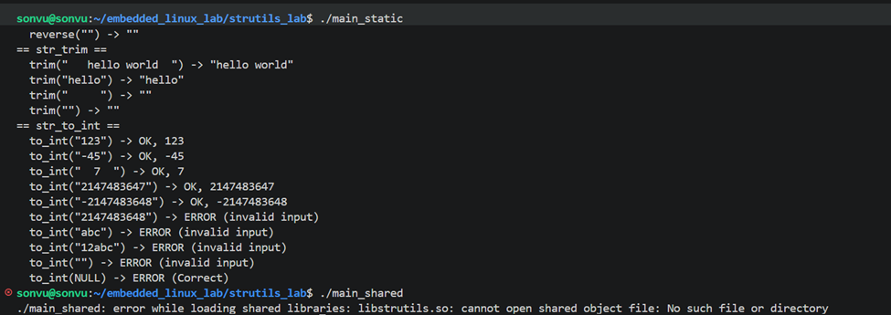

*Hình 3.1. `main_static` hoạt động bình thường, `main_shared` báo lỗi `cannot open shared object file`.*

- **Giải thích:** Tuỳ chọn `-L.` chỉ có hiệu lực ở bước biên dịch. Tại thời điểm hoạt động, bộ nạp động (dynamic loader, `ld-linux`) chỉ tìm thư viện ở các vị trí mặc định như `/lib`, `/usr/lib` và bộ nhớ đệm `/etc/ld.so.cache`; thư mục hiện tại không nằm trong danh sách này.
- **Cách khắc phục tạm thời:** chỉ định thêm đường dẫn tìm kiếm bằng biến môi trường `LD_LIBRARY_PATH`:

```bash
LD_LIBRARY_PATH=. ./main_shared
```
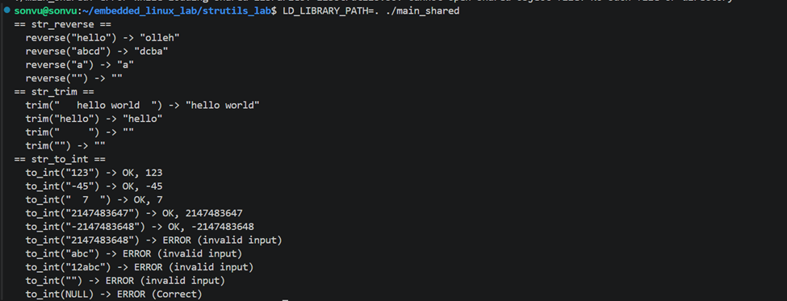
Hình 3.2. Khắc phục bằng cách thêm dường dẫn hoạt động bình thường,
Kết quả của hai chương trình được so sánh bằng lệnh `diff`:

```bash
./main_static > out_static.txt
LD_LIBRARY_PATH=. ./main_shared > out_shared.txt
diff out_static.txt out_shared.txt && echo "IDENTICAL"
```

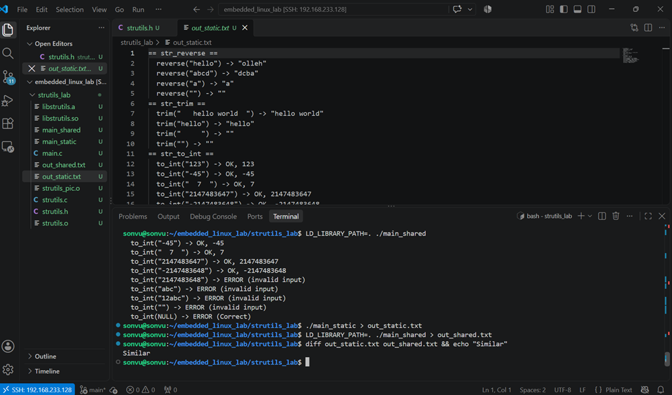

*Hình 3.3. Đầu ra của `main_static` và `main_shared` hoàn toàn trùng khớp.*

### 4.3. Chứng minh loại liên kết

```bash
ldd main_static
ldd main_shared
LD_LIBRARY_PATH=. ldd main_shared
nm main_static | grep str_
nm -D main_shared | grep str_
```

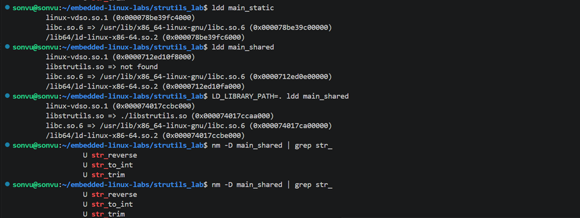

*Hình 3.4. Kết quả `ldd` và `nm` đối với `main_static` và `main_shared`.*

**Phân tích:**

- **`main_static`:** Kết quả `ldd` không chứa `libstrutils.so`, và `nm` cho thấy ba hàm `str_*` với ký hiệu `T`. Điều này chứng tỏ mã của `strutils` đã được nhúng vào tệp hoạt động. Thư viện `libc.so.6` vẫn xuất hiện vì chỉ `libstrutils` được liên kết tĩnh, còn libc vẫn được liên kết động.
- **`main_shared`:** Kết quả `ldd` có dòng `libstrutils.so`; giá trị là `not found` khi chưa chỉ định đường dẫn và `./libstrutils.so` khi đặt `LD_LIBRARY_PATH=.`. Lệnh `nm -D` cho thấy ba hàm có ký hiệu `U` (undefined), tức tệp chỉ ghi nhận sự phụ thuộc vào các hàm này, còn mã của chúng nằm trong tệp `.so` và được nạp khi hoạt động.

## 5. BÀI 4: TỰ ĐỘNG HOÁ QUÁ TRÌNH XÂY DỰNG BẰNG MAKEFILE

### 5.1. Thiết kế Makefile

- **Biến `CC` và `CFLAGS`:** được định nghĩa một lần và tái sử dụng; khi biên dịch chéo (cross-compile) cho hệ thống nhúng chỉ cần thay đổi `CC`.
- **Biến tự động:** `$@` biểu diễn tên đích, `$^` biểu diễn toàn bộ tệp phụ thuộc.
- **`.PHONY`:** khai báo `all`, `static`, `shared` và `clean` là các đích giả, luôn được hoạt động kể cả khi tồn tại tệp trùng tên.
- **Cây phụ thuộc:** `make` so sánh thời gian sửa đổi của đích và các tệp phụ thuộc, chỉ xây dựng lại phần đã thay đổi (incremental build). Tệp `strutils.h` nằm trong danh sách phụ thuộc nên thay đổi tệp tiêu đề cũng kích hoạt việc xây dựng lại.

### 5.2. Các đích (target) của Makefile

| Đích | Lệnh gọi | Chức năng |
|------|----------|-----------|
| `all` | `make` hoặc `make all` | Đích mặc định (luật đầu tiên); xây dựng cả `main_static` và `main_shared` |
| `static` | `make static` | Chỉ xây dựng `libstrutils.a` và `main_static` |
| `shared` | `make shared` | Chỉ xây dựng `libstrutils.so` và `main_shared` |
| `clean` | `make clean` | Xoá toàn bộ tệp sinh ra: `.o`, `.a`, `.so` và tệp hoạt động |

### 5.3. Kết quả kiểm thử

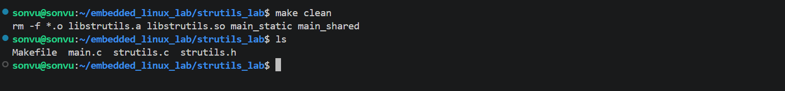

*Hình 4.1. Kiểm thử `make clean`.*

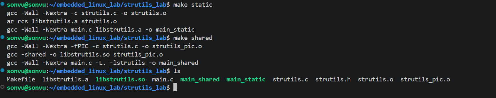

*Hình 4.2. Kiểm thử `make static` và `make shared`: chỉ xuất hiện `.a` và `main_static`, không có `.so`.* ; chỉ xuất hiện `.so` và `main_shared`, không có `.a`.*

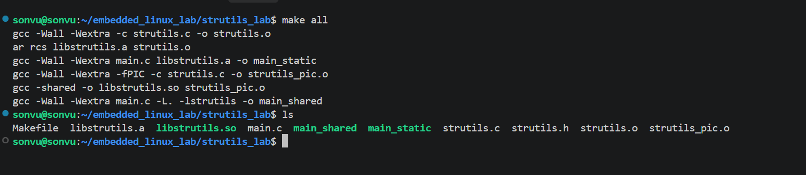

*Hình 4.3. Kiểm thử `make all`: xây dựng đầy đủ, không phát sinh cảnh báo.*

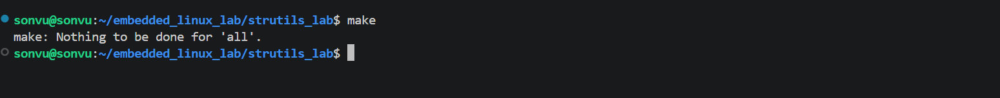

*Hình 4.4. hoạt động `make` lần thứ hai cho thông báo `Nothing to be done for 'all'.`, tức không xây dựng lại phần không thay đổi.*

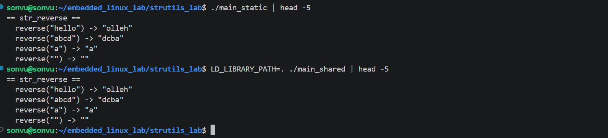

*Hình 4.5 Kiểm tra kết quả.*
## 6. BÀI 5: THÍ NGHIỆM VÀ TRẢ LỜI CÂU HỎI

### Câu 1. So sánh kích thước của `main_static` và `main_shared`

#### 1.1. Lệnh thực hiện

```bash
ls -lh main_static main_shared
size main_static main_shared
```

#### 1.2. Kết quả

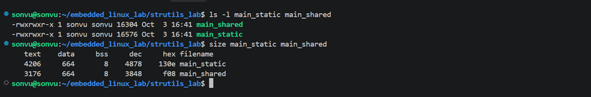

*Hình 5.1. Kích thước các phân vùng và dung lượng tệp.*

| Tệp | text | data | bss | dec | Dung lượng file trên ổ cứng | 
|-----|------|------|-----|-----| -----|
| `main_static` | 4206 | 664 | 8 | 4878 | 16576 byte |
| `main_shared` | 3176 | 664 | 8 | 3848 | 16304 byte |
| Chênh lệch | 1030 | 0 | 0 | 1030 | 272 byte |

Hai nhận xét rút ra từ bảng:

- text lệch 1030 byte nhưng dung lượng trên đĩa chỉ lệch 272 byte. Hai con số này không bằng nhau.

#### 1.3. Giải thích

- Phân vùng `text` của `main_static` lớn hơn của `main_shared` 1030 byte (4206 so với 3176). Phần chênh lệch này chủ yếu là mã máy của ba hàm `str_reverse`, `str_trim` và `str_to_int` cùng các dữ liệu đi kèm, được sao chép vào tệp thực thi trong quá trình liên kết tĩnh.
- Với `main_shared`, tệp chỉ lưu thông tin về các ký hiệu cần phân giải và tên thư viện phụ thuộc; mã máy nằm trong `libstrutils.so` và chỉ được nạp khi chương trình chạy.
- Hai cột `data` và `bss` có giá trị bằng nhau do thư viện không định nghĩa biến toàn cục.
- Về dung lượng trên đĩa, `main_static` lớn hơn `main_shared` 272 byte, nhỏ hơn đáng kể so với mức chênh 1030 byte ở phân vùng `text`. Lệnh `size` chỉ thống kê các phân vùng được nạp vào bộ nhớ, trong khi `ls -l` tính toàn bộ tệp, bao gồm bảng ký hiệu, bảng chuỗi và phần đệm căn chỉnh theo trang bộ nhớ; các yếu tố này làm giảm độ chênh lệch quan sát được.

---

### Câu 2. Hiện tượng khi đổi tên `libstrutils.so`

#### 2.1. Lệnh thực hiện

```bash
mv libstrutils.so libstrutils.so.bak
./main_static
LD_LIBRARY_PATH=. ./main_shared
ldd main_shared
mv libstrutils.so.bak libstrutils.so
```

#### 2.2. Kết quả

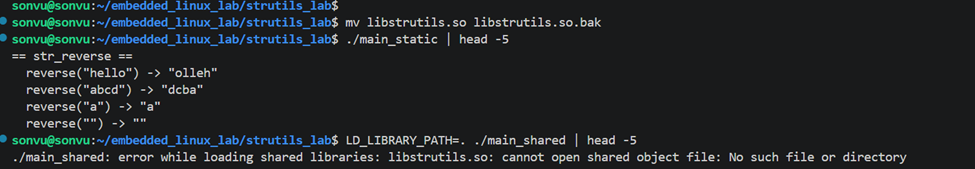

*Hình 5.2.1 Kết quả hoạt động sau khi đổi tên thành `libstrutils.so.bak`.*

- `./main_static` vẫn hoạt động bình thường.
- `./main_shared` không hoạt động được và báo lỗi `error while loading shared libraries: libstrutils.so: cannot open shared object file: No such file or directory`.

#### 2.3. Giải thích

- **`main_static`:** Mã cần thiết đã được nhúng vào tệp hoạt động từ khi biên dịch nên không còn phụ thuộc vào tệp `.so` tại thời điểm chạy.
- **`main_shared`:** Bộ nạp động phải tìm và nạp `libstrutils.so` mỗi lần chương trình khởi động. Khi không tìm thấy thư viện, bộ nạp huỷ tiến trình và báo lỗi. Kết quả của `ldd` cũng cho thấy `libstrutils.so => not found`.

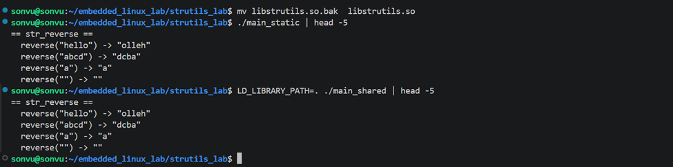

*Hình 5.2.2 Kết quả hoạt động sau khi đổi tên lại về `libstrutils.so`.*


---

### Câu 3. Thay đổi mã nguồn của một hàm trong `strutils.c`

#### 3.1. Thí nghiệm

Thêm dòng `printf("[strutils v2] str_reverse called\n");` vào đầu hàm `str_reverse` (kèm `#include <stdio.h>`), sau đó thực hiện:

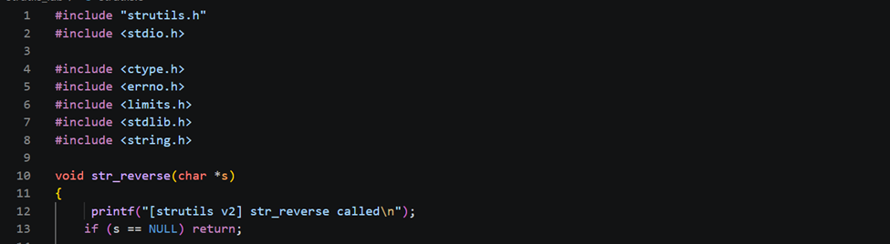

*Hình 5.3.1 Thay đổi mã nguồn của một hàm trong `strutils.c`.*
```bash
make libstrutils.so
LD_LIBRARY_PATH=. ./main_shared | head -5
./main_static | head -5
make libstrutils.a
./main_static | head -5
make main_static
./main_static | head -5
```

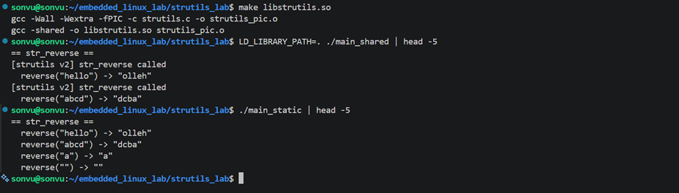
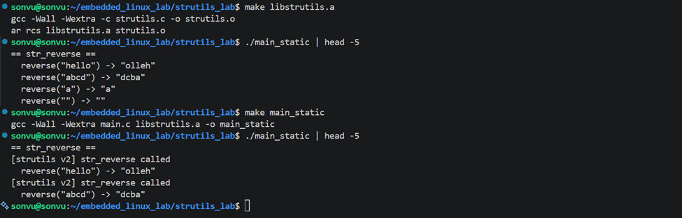
*Hình 5.3. Kết quả thí nghiệm thay đổi hàm `str_reverse`.*

#### 3.2. Đối với thư viện tĩnh

1. Biên dịch lại `strutils.c` và tạo lại `libstrutils.a` (`make libstrutils.a`).
2. **Bắt buộc liên kết lại tệp hoạt động** (`make main_static`).
   - *Lý do:* Mã thư viện đã được sao chép vào `main_static` ở thời điểm liên kết. Nếu không liên kết lại, tệp hoạt động tiếp tục chạy phiên bản mã cũ.

#### 3.3. Đối với thư viện động

1. Biên dịch lại với `-fPIC` và tạo lại `libstrutils.so` (`make libstrutils.so`).
2. **Không cần xây dựng lại `main_shared`**; chỉ cần chạy lại chương trình. Bộ nạp động nạp phiên bản `libstrutils.so` mới ở mỗi lần hoạt động nên thay đổi có hiệu lực ngay, với điều kiện tên hàm và giao diện (ABI) không thay đổi.

---

### Câu 4. Tuỳ chọn biên dịch bổ sung khi xây dựng thư viện động

#### 4.1. Tuỳ chọn cần thêm

- **`-fPIC`** ở bước biên dịch ra tệp đối tượng.
- **`-shared`** ở bước liên kết ra tệp `.so`.

#### 4.2. Giải thích

- **Thư viện tĩnh:** Mã được nối vào tệp hoạt động ở thời điểm liên kết và địa chỉ do trình liên kết ấn định, do đó không cần mã độc lập vị trí.
- **Thư viện động:** Thư viện được nạp vào bộ nhớ và chia sẻ giữa nhiều tiến trình, và có thể được ánh xạ ở địa chỉ khác nhau tuỳ tiến trình và tuỳ lần chạy (do cơ chế ASLR). Vì vậy mã của thư viện không thể chứa địa chỉ tuyệt đối cố định.
- Tuỳ chọn `-fPIC` khiến trình biên dịch sinh mã truy cập hàm và dữ liệu theo địa chỉ tương đối, thông qua bảng GOT (Global Offset Table) và PLT (Procedure Linkage Table). Nhờ đó cùng một đoạn mã trong bộ nhớ vật lý có thể được ánh xạ vào các địa chỉ ảo khác nhau và được chia sẻ giữa các tiến trình.

#### 4.3. Thí nghiệm kiểm chứng

```bash
gcc -fno-pie -c strutils.c -o strutils_nopic.o
gcc -shared -o test_nopic.so strutils_nopic.o
```

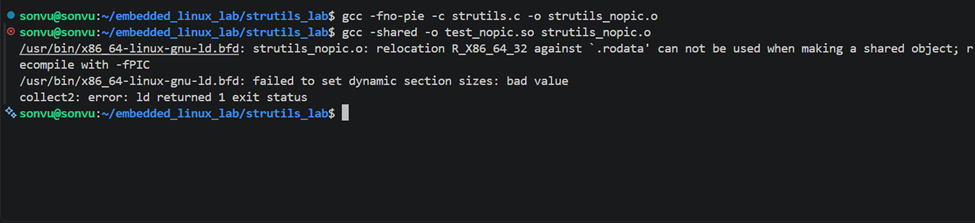

*Hình 5.4. Kết quả liên kết thư viện động từ tệp đối tượng không có `-fPIC`. (`<Ghi chú: gcc báo lỗi relocation ... recompile with -fPIC; hoặc không báo lỗi do Ubuntu bật PIE theo mặc định>`)*

---

### Câu 5. Các cách để chương trình xác định vị trí thư viện động khi chạy

| Phương pháp | Cú pháp / thiết lập | Phạm vi áp dụng |
|-------------|---------------------|-----------------|
| Biến môi trường `LD_LIBRARY_PATH` | `LD_LIBRARY_PATH=. ./main_shared` | Thử nghiệm và gỡ lỗi. Không phù hợp khi triển khai thực tế do dễ bị bỏ sót và ảnh hưởng đến mọi chương trình trong phiên làm việc |
| Nhúng đường dẫn vào tệp hoạt động (rpath/runpath) | `gcc main.c -L. -lstrutils -Wl,-rpath,'$ORIGIN' -o main_rpath` | Đóng gói chương trình cùng thư viện trong một thư mục; chạy được mà không cần thiết lập môi trường |
| Cài vào thư mục hệ thống và cập nhật bộ nhớ đệm | `sudo cp libstrutils.so /usr/local/lib/ && sudo ldconfig` | Thư viện dùng chung cho nhiều chương trình |
| Khai báo thư mục trong cấu hình của bộ nạp | Thêm đường dẫn vào `/etc/ld.so.conf.d/*.conf` rồi `sudo ldconfig` | Thư mục thư viện riêng, áp dụng cho toàn hệ thống |

---

### Câu 6. Lựa chọn giữa thư viện tĩnh và thư viện động trong hệ thống nhúng

#### 6.1. Trường hợp nên chọn thư viện tĩnh

- **Hệ thống chỉ chạy một firmware hoặc một ứng dụng:** không có đối tượng để chia sẻ thư viện, liên kết tĩnh đơn giản hơn.
- **Yêu cầu độ tin cậy cao:** hệ thống không được phụ thuộc vào sự hiện diện hoặc đúng phiên bản của tệp `.so` tại thời điểm chạy, đặc biệt với thiết bị đặt ở xa và khó bảo trì.
- **Tài nguyên tối giản:** các môi trường như initramfs, bootloader hoặc hệ thống không có bộ nạp động.
- **Thời gian khởi động quan trọng:** tránh chi phí nạp thư viện và phân giải ký hiệu động.
- **Cần kiểm soát chính xác phiên bản mã đang hoạt động.**

#### 6.2. Trường hợp nên chọn thư viện động

- **Hệ thống chạy nhiều ứng dụng:** một bản sao thư viện được lưu trong bộ nhớ Flash và một bản mã được chia sẻ trong RAM, giúp tiết kiệm tài nguyên.
- **Yêu cầu cập nhật linh hoạt:** khi cần vá lỗi, chỉ phải thay thế tệp `.so` (ví dụ qua cập nhật từ xa OTA) mà không cần xây dựng lại từng ứng dụng, như kết quả thí nghiệm ở Câu 3.
- **Hệ thống Linux đầy đủ:** đã có sẵn bộ nạp động và hệ thống tệp.
- **Cần nạp mô-đun hoặc plugin trong lúc chạy.**
- **Ràng buộc giấy phép (ví dụ LGPL):** liên kết động giúp đáp ứng yêu cầu cho phép người dùng thay thế thư viện.

**Kết luận:** Việc lựa chọn là sự cân bằng giữa hiệu quả sử dụng bộ nhớ và khả năng cập nhật (ưu thế của thư viện động) với tính đơn giản và độ tin cậy (ưu thế của thư viện tĩnh).

## 7. BÀI TẬP BỔ SUNG: KHẢO SÁT PHÂN VÙNG BỘ NHỚ CỦA CHƯƠNG TRÌNH C

### 7.1. Cơ sở lý thuyết

| Vùng nhớ | Nội dung | Quyền truy cập | Đặc điểm |
|----------|----------|----------------|----------|
| **Text** | Mã máy của các hàm | Đọc, hoạt động | Kích thước cố định, không ghi được |
| **Rodata** | Hằng số, chuỗi hằng | Chỉ đọc | Thường được xếp cùng nhóm với vùng text |
| **Data** | Biến toàn cục và biến tĩnh **đã khởi tạo** giá trị khác 0 | Đọc, ghi | Giá trị ban đầu được lưu trong tệp hoạt động |
| **BSS** | Biến toàn cục và biến tĩnh **chưa khởi tạo hoặc bằng 0** | Đọc, ghi | Không chiếm dung lượng trong tệp; hệ điều hành cấp vùng nhớ đã xoá về 0 khi nạp |
| **Heap** | Bộ nhớ cấp phát động (`malloc`) | Đọc, ghi | Do lập trình viên quản lý bằng `malloc` và `free` |
| **Stack** | Biến cục bộ, tham số, địa chỉ trả về | Đọc, ghi | Tự động cấp phát và giải phóng theo lệnh gọi hàm |

### 7.2. Phương pháp

Chương trình `memory_layout_lab/main.c` khai báo nhiều loại biến và in địa chỉ bằng định dạng `%p` dưới dạng bảng gồm bốn cột: *Region*, *Name*, *Address* và *Note*.

| Nhóm | Biến |
|------|------|
| Hàm | `main`, `func_a` |
| Hằng | `g_const`, chuỗi hằng `"hello"` |
| Toàn cục đã khởi tạo | `g_init`, `s_init` (static cấp tệp), `g_str` (con trỏ toàn cục) |
| Toàn cục chưa khởi tạo hoặc bằng 0 | `g_uninit`, `g_zero`, `s_uninit`, `g_buf[4096]` |
| Static cục bộ | `call_count` (đã khởi tạo), `call_zero` (chưa khởi tạo) |
| Heap | `p1`, `p2` (hai lần gọi `malloc(16)`) |
| Stack | `local_init`, `local_uninit`, `local_arr`, `&p1`, `&p2`, `local_a`, `x` trong hàm đệ quy |

```bash
cd memory_layout_lab
gcc -Wall -Wextra main.c -o memlayout
./memlayout
setarch $(uname -m) -R ./memlayout    # tắt ASLR để địa chỉ ổn định giữa các lần chạy
```

### 7.3. Kết quả in địa chỉ (`%p`)

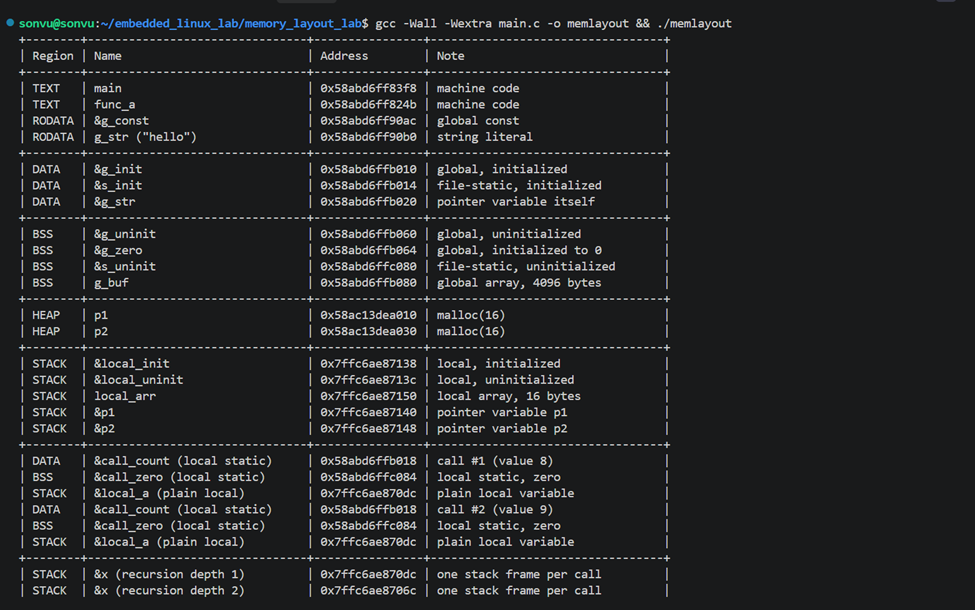

*Hình 6.1. Bảng địa chỉ các biến được in bằng `%p`.*


### 7.4. Phân tích kết quả

1. Kiến trúc phân bổ tổng thể (Từ thấp đến cao)
Không gian bộ nhớ của chương trình được sắp xếp rất khoa học, tách biệt rõ ràng các thành phần:

- Phân vùng TEXT (Mã máy) & RODATA (Hằng số): Nằm ở đáy (địa chỉ thấp nhất, khoảng 0x58abd...) để bảo vệ an toàn cho mã lệnh của hàm (main, func_a) và chuỗi không đổi ("hello").

- Phân vùng DATA & BSS: Nằm ngay trên vùng Text.

- Phân vùng HEAP: Nằm ở khúc giữa bộ nhớ (khoảng 0x58ac1...), cấp phát linh hoạt khi chạy.

- Phân vùng STACK: Nằm tuốt trên đỉnh (địa chỉ cao nhất, khoảng 0x7ffc6...). Việc xếp Stack ở đỉnh, Heap ở giữa giúp hai vùng này có không gian rộng lớn để phát triển ngược chiều nhau mà không bị đụng độ (tràn bộ nhớ).

2. Chiến lược tiết kiệm ổ cứng nhờ phân tách DATA và BSS
Chương trình rất thông minh khi phân loại biến toàn cục (global) và biến tĩnh (static):

- Vùng DATA: Dành cho các biến đã được gán sẵn giá trị khác 0 (VD: g_init, s_init, biến đếm call_count cục bộ).

- Vùng BSS: Dành riêng cho biến chưa gán hoặc gán bằng 0 (VD: g_uninit, g_zero, mảng lớn g_buf).

- Mục đích: Các biến trong BSS không cần lưu dữ liệu thật vào file thực thi trên ổ cứng. Khi chương trình chạy, hệ điều hành sẽ tự động điền một loạt số 0 vào vùng này, giúp file chạy (nhị phân) nhẹ đi rất nhiều.

3. Đặc tính cấp phát động của HEAP

- Heap phát triển theo chiều tăng dần (đi lên).

- Bằng chứng: Biến p1 xin 16 bytes ở địa chỉ ...a010, biến p2 xin 16 bytes tiếp theo lại nằm ở ...a030.

4. Đặc tính phát triển ngược của STACK

- Stack là nơi chứa tạm thời toàn bộ các biến cục bộ của hàm (như local_a, local_arr, con trỏ &p1).

- Ngược với Heap, Stack phát triển theo chiều giảm dần (đi xuống).

## 8. KẾT LUẬN

- Thư viện `strutils` được cài đặt với ba hàm hoạt động đúng trên các đầu vào thông thường, giá trị biên và đầu vào lỗi; mã nguồn biên dịch không phát sinh cảnh báo với `-Wall -Wextra`.
- Thư viện được đóng gói thành `libstrutils.a` và `libstrutils.so`; hai tệp hoạt động `main_static` và `main_shared` cho cùng kết quả, và loại liên kết của chúng được chứng minh bằng `ldd` và `nm`.
- Makefile cung cấp các đích `all`, `static`, `shared` và `clean`, đồng thời bảo đảm không xây dựng lại phần không thay đổi.
- Các kết quả cho thấy: thư viện tĩnh làm tệp hoạt động độc lập nhưng phải liên kết lại khi mã thư viện thay đổi; thư viện động hỗ trợ cập nhật và chia sẻ tài nguyên nhưng phụ thuộc vào khả năng bộ nạp động xác định được tệp `.so` khi chạy.
- Bài tập bổ sung xác nhận mỗi loại biến nằm ở vùng nhớ tương ứng với vòng đời và quyền truy cập của nó; các cột `text`, `data` và `bss` của lệnh `size` phản ánh trực tiếp các phân vùng này.